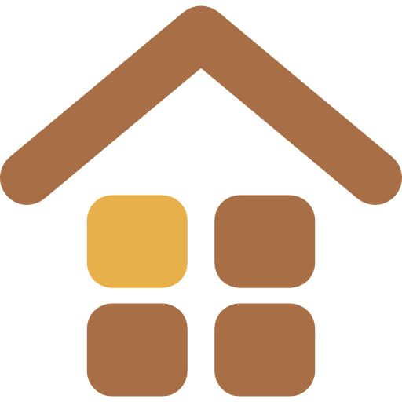
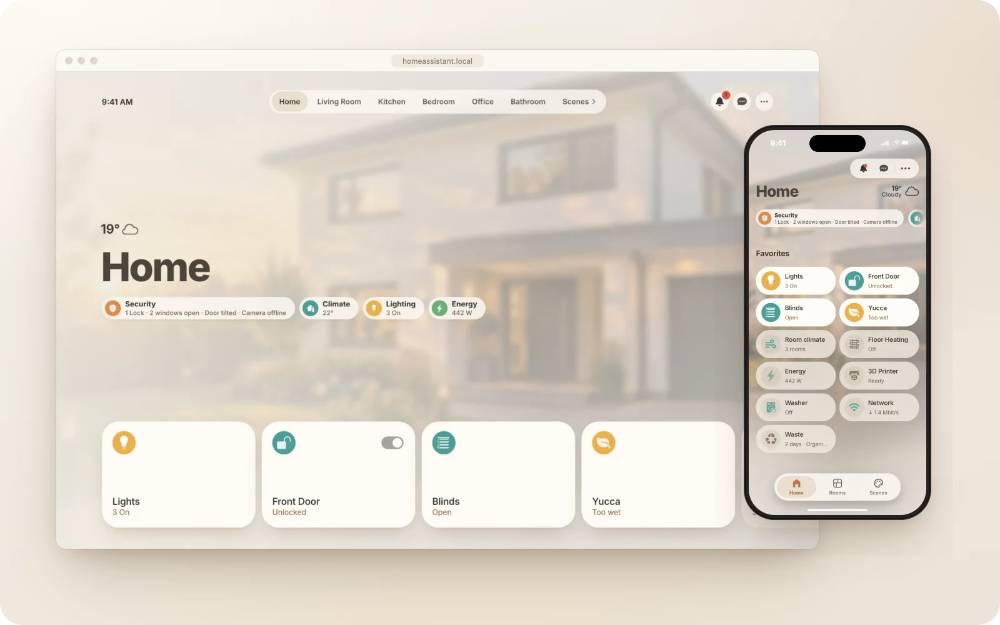
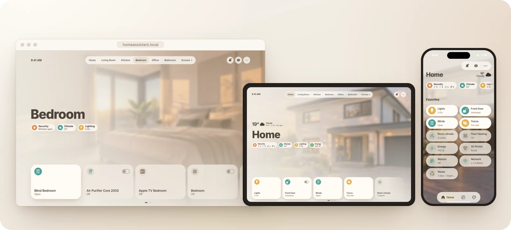
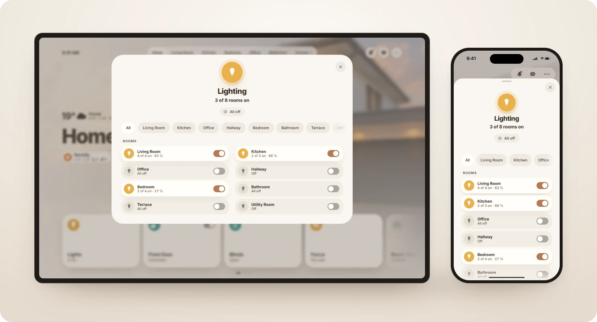
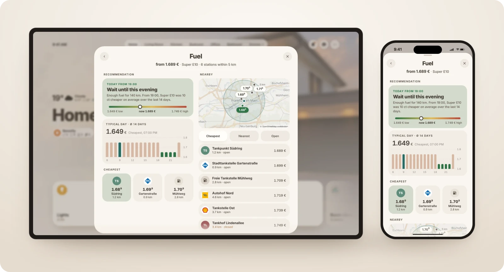
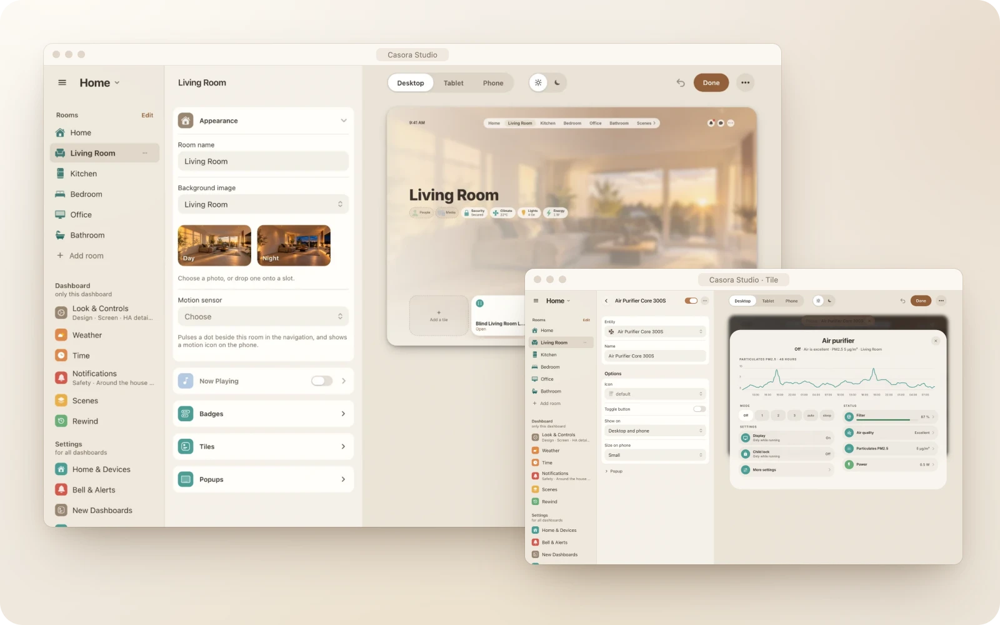
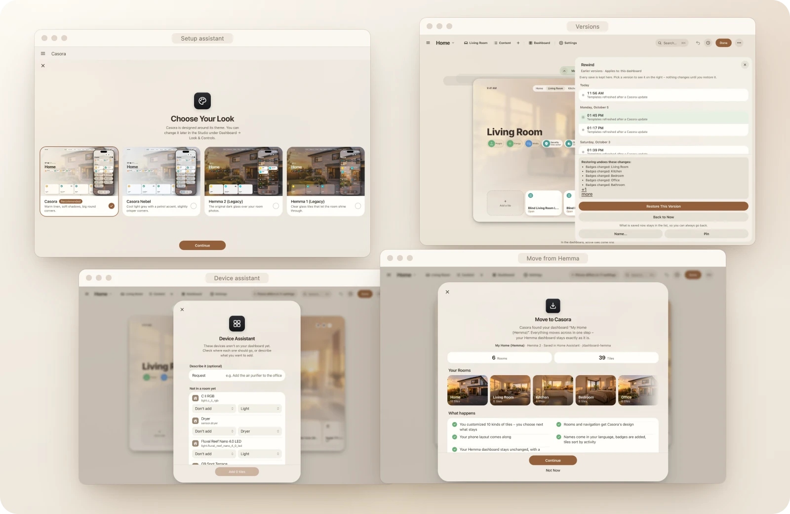

<h1>Casora</h1>

<b>Your home. At ease.</b> 
A calm, photo-backed dashboard for Home Assistant that sets itself up. 
Shape the rest room by room in a visual studio. No YAML.

<a href="https://sh1ft-w.github.io/casora"><b>Website</b></a> &nbsp;·&nbsp; <a href="#install"><b>Install</b></a> &nbsp;·&nbsp; <a href="docs/guide.md"><b>Guide</b></a> &nbsp;·&nbsp; <a href="CHANGELOG.md"><b>Changelog</b></a>

 

<picture>
  <source media="(prefers-color-scheme: dark)" srcset="docs/images/readme-hero-dark.webp" />
  
</picture>

## Why Casora

- **It already knows your home.** Casora reads Home Assistant's device registry, puts every device into its room and groups what belongs together.
- **Design it, don't code it.** Casora Studio lives in the sidebar. Change rooms, tiles, badges and popups in place, with a live preview for desktop, tablet and phone.
- **One home, three screens.** Desktop and wall tablet show each room with its photo. Phones get a layout of their own with your favourites first.
- **A popup for every device.** Lights, climate, energy, locks, blinds, media, cameras, plants, washers and dryers each open a popup of their own.
- **Nothing is ever lost.** Every save becomes a version you can preview and restore.
- **It stays at home.** No cloud, no account, no telemetry. AI features are optional and use the provider you already set up.

Casora recognises robot vacuums, washers and dryers, dishwashers, 3D printers, home batteries, cars, waste collection, calendars and your network, and gives each its own tile and popup. Room photos for 31 room types, by day and by night, are included.

## A look around

  <picture>
    <source media="(prefers-color-scheme: dark)" srcset="docs/images/readme-screens-dark.webp" />
    
  </picture>
   <b>One home, three screens.</b> Every screen gets a layout made for it, not a shrunken copy.

  <picture>
    <source media="(prefers-color-scheme: dark)" srcset="docs/images/readme-popups-dark.webp" />
    
  </picture>
   <b>Tap a tile, see the whole story.</b> Controls on the left, devices on the right, the rarely used tucked away under More.

  <picture>
    <source media="(prefers-color-scheme: dark)" srcset="docs/images/readme-popups2-dark.webp" />
    
  </picture>
   <b>Plants and room climate.</b> Plain words for what a plant needs, and a day of readings for every room.

  <picture>
    <source media="(prefers-color-scheme: dark)" srcset="docs/images/readme-studio-dark.webp" />
    
  </picture>
   <b>Casora Studio.</b> Rooms, tiles, badges and popups, edited in place. Nothing is written until you click Save.

  <picture>
    <source media="(prefers-color-scheme: dark)" srcset="docs/images/readme-tools-dark.webp" />
    
  </picture>
   <b>Assistants for the tedious part.</b> Pick a look, place new devices, move from Hemma, go back to any version.

The look is *Casora*: warm linen, generous corners and soft shadows, in light and dark, set in Inter. It follows Home Assistant's theme mode. The classic glass looks from Hemma are still there as legacy options.

## Requirements

| Requirement | Notes |
|---|---|
| **Home Assistant 2026.9** or newer | Required, with dashboards in storage mode (the default). |
| [**UI eXtension (UIX)**](https://github.com/Lint-Free-Technology/uix) | Required, from HACS. Needs a restart. Use it instead of card-mod, not both. |
| [**button-card**](https://github.com/custom-cards/button-card) | Required, from HACS. |
| [**apexcharts-card**](https://github.com/RomRider/apexcharts-card) | Optional, for the energy and history charts in popups. |
| An **AI task** in Home Assistant | Optional, for the [AI features](docs/guide.md#ai-features-optional). |

Casora checks all of this when you first open the Studio and links you to anything missing. Helpers, scripts, resources and the theme are created by Casora itself.

## Install

There are two ways to install Casora: through HACS as a custom repository (recommended, updates arrive by themselves) or by hand.

### With HACS

1. **Add the repository.** Click the button above, or in HACS open the menu, choose **Custom repositories** and add `https://github.com/SH1FT-W/casora` with the type **Integration**.
2. **Download Casora**, together with UIX and button-card if you don't have them yet, then **restart Home Assistant** once.
3. **Add the integration** under Settings → Devices & services → Add integration → **Casora**.
4. **Open Casora Studio** in the sidebar. The setup assistant takes it from there: pick a look, let Casora sort your devices into rooms, check the preview and create your dashboard.

Updates then arrive through HACS like any other integration. After an update, Casora brings your dashboards up to its new templates and saves a version first, so you can always go back. It never restarts Home Assistant on its own.

### Manual install

1. Download the [latest release](https://github.com/SH1FT-W/casora/releases) and copy its `custom_components/casora` folder into `/config/custom_components/` on your Home Assistant.
2. Install UIX and button-card if you don't have them yet, then **restart Home Assistant**.
3. Add the **Casora** integration and open **Casora Studio** in the sidebar, as above.

To update, replace the folder with the new release and restart. Without HACS, new versions show up under Settings → Updates in Home Assistant. Step by step in the [guide](docs/guide.md#install).

## Coming from Hemma

Moving feels like an update. Casora finds your Hemma dashboards, both Hemma 1 (YAML) and Hemma 2 (Hemma Studio), and carries over rooms, tiles, the phone layout and your own cards. For every tile you changed yourself, you decide: keep yours, take Casora's, or let AI merge the two. Your own JS modules, customised popups and folders your automations write to are kept as they are.

Casora builds a new dashboard next to your old one and saves a copy of the original first. Your Hemma dashboard stays untouched until you choose to hide it. Step by step in the [guide](docs/guide.md#moving-from-hemma).

## Optional AI

With an AI task set up in Home Assistant, Casora can place devices that have no room, name tiles, and adapt your own cards to its look. On the dashboard it adds an energy coach, a heating coach, a ventilation coach, camera descriptions, a plant doctor, an aquarium doctor, a bike check, an update check against your setup and a recipe of the week.

AI runs on your own provider account. Before each AI step in the Studio, Casora shows a cost estimate. Each feature has its own schedule (off, automatic or a time you pick), and on a new install all of them start switched off. Without an AI task, these features simply stay off. More in the [guide](docs/guide.md#ai-features-optional).

## Privacy

Casora runs entirely inside your Home Assistant. There is no Casora cloud, no account, no analytics and no telemetry. Dashboards, versions and settings live on your own instance and are part of its regular backups.

It only reaches outside for AI features you turn on (through the provider you configured), for integration logos from `brands.home-assistant.io` and to look for new Casora releases on GitHub. Updates come through HACS or the release page. The full list is in the [guide](docs/guide.md#privacy-in-detail).

## Documentation

- [**Guide**](docs/guide.md): setup assistant, Studio, looks, moving from Hemma, rewind, AI features, FAQ and troubleshooting, actions
- [**Advanced YAML**](docs/ADVANCED.md): building and tuning Casora dashboards by hand
- [**Contributing**](docs/contributing.md): pull requests and screenshots
- [**Changelog**](CHANGELOG.md): what changed in each version

Found a bug or have an idea? [Open an issue](https://github.com/SH1FT-W/casora/issues).

## Credits and license

Casora is built on [Hemma](https://github.com/willsanderson/Hemma) by [Will Sanderson](https://github.com/willsanderson), which grew out of [Homio](https://github.com/iamtherufus/Homio) by [@iamtherufus](https://github.com/iamtherufus). Thank you both.

Released under the [MIT License](LICENSE). The original Hemma copyright notice is kept.

Casora is an independent project and is not affiliated with Home Assistant or Nabu Casa.
